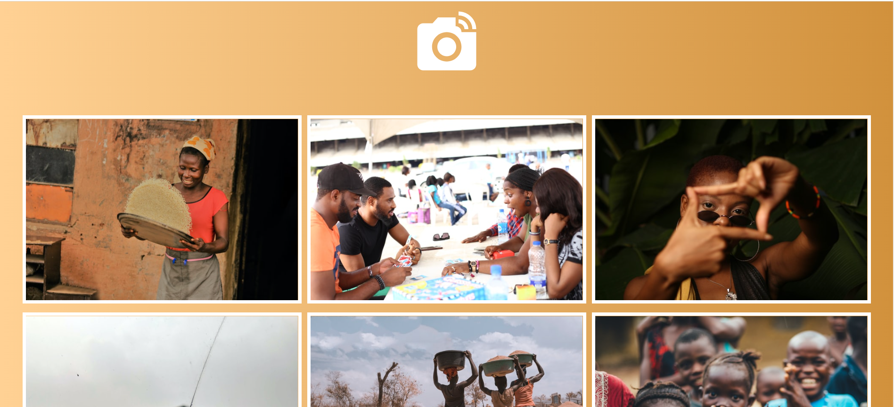

# The Unsplash Clone

<!-- PROJECT SHIELDS -->
<!--
*** I'm using markdown "reference style" links for readability.
*** Reference links are enclosed in brackets [ ] instead of parentheses ( ).
*** See the bottom of this document for the declaration of the reference variables
*** for contributors-url, forks-url, etc. This is an optional, concise syntax you may use.
*** https://www.markdownguide.org/basic-syntax/#reference-style-links
-->
[![LinkedIn][linkedin-shield]][linkedin-url]


<!-- PROJECT LOGO -->
<br />
<p align="center">
  <a href="https://github.com/konichar/the-unsplash-clone">
    
  </a>

  <h3 align="center">Upload, Share and Entertain</h3>

  <p align="center">
   A clone of the unsplash project powered by react and django web framework.
    <br />
    <a href="https://github.com/konichar/the-unsplash-clone"><strong>Explore the docs »</strong></a>
    <br />
    <br />
    <a href="https://the-unsplash-clone.herokuapp.com">View live demo site </a>
    ·
    <a href="https://github.com/konichar/the-unsplash-clone/issues">Report Bug</a>
    ·
    <a href="https://github.com/konichar/the-unsplash-clone/issues">Request Feature</a>
  </p>
</p>


<!-- ABOUT THE PROJECT -->
## About The Project

<!-- [![The Unsplash Clone][product-screenshot]](media/readme/desktop.png) -->
<p align=center>
 
</p>
This is a web application written in React and Django rest. 

It allows all users Upload new Images which are processed by the django backend and stored on an AWS S3 bucket. 

Users can view all free stock photos that have been previously uploaded by other users.

This project can be used as a boiler plate for more ambitious projects 

Here's why:
* Your time should be focused on creating something amazing. A project that solves a problem and helps others
* You shouldn't be doing the same tasks over and over like resource configuration.

### Built With 💖
Major frameworks and services used in the development of this project.
* [React](https://reactjs.org/)  -- A JavaScript library for building user interfaces
* [Django](https://www.djangoproject.com/) -- Python Web framework that encourages rapid development and clean, pragmatic design
* [Django REST framework](https://www.django-rest-framework.org/) -- Powerful and flexible toolkit for building Web APIs.
* [Heroku](https://www.heroku.com/) -- Platform as a service (PaaS) that enables developers to build, run, and operate applications entirely in the cloud.
* [AWS S3](https://aws.amazon.com/s3/) --  Reliability & Scalability With AWS Online Storage Solutions for static and media files
* [PostgreSQL](https://www.postgresql.org/) --  Open-source, highly stable relational database management system emphasizing extensibility and SQL compliance.
<!-- GETTING STARTED -->
## Getting Started

To get a local copy up and running follow these simple example steps.

* Clone the repository, which includes both backend and frontend.
  ```sh
  git clone https://github.com/konichar/the-unsplash-clone.git
  ```

### Django Backend Prerequisites

You need to have the following installed
1. Python
  [https://www.python.org/](https://www.python.org/)
  
2. Install application python dependencies
  ```sh
  pip install -r requirements.txt
  ```
3. Migrate database
  ```sh
  python manage.py migrate
  ```
4. Start Django server and Rest API
  ```sh
  python manage.py runserver
  ```
  The backend server should be `localhost:8000.`


### React Frontend Prerequisites

You need to have the following installed
1. Nodejs
  [https://nodejs.org/](https://nodejs.org/)
  
2. Install application React dependencies
  ```sh
  yarn install
  ```
3. Start frontend server
  ```sh
  yarn start
  ```
  The Frontend server should be `localhost:3000.`

<!-- USAGE EXAMPLES -->
## Usage

This project is preconfigured to be deployable on Heroku. 
Static assets and media files are collected and hosted on AWS S3 when `python manage.py collectstatic` is run. 

_For more info about how django manages static files, please refer to the [Documentation](https://docs.djangoproject.com/en/3.1/howto/static-files/deployment/)_

<!-- ROADMAP -->
## Roadmap

See the [open issues](https://github.com/konichar/the-unsplash-clone/issues) for a list of proposed features (and known issues).

<!-- CONTRIBUTING -->
## Contributing

Contributions are what make the open source community such an amazing place to be learn, inspire, and create. Any contributions you make are **greatly appreciated** 😊

1. Fork the Project
2. Create your Feature Branch (`git checkout -b feature/AmazingFeature`)
3. Commit your Changes (`git commit -m 'Add some AmazingFeature'`)
4. Push to the Branch (`git push origin feature/AmazingFeature`)
5. Open a Pull Request

<!-- LICENSE -->
## License

Distributed under the MIT License. See `LICENSE` for more information.

<!-- CONTACT -->
## Contact
Project Link: [https://github.com/konichar/the-unsplash-clone](https://github.com/konichar/the-unsplash-clone)

Demo Link: [https://the-unsplash-clone.herokuapp.com/](https://the-unsplash-clone.herokuapp.com/)


<p align=center>

If you find this project interesting don't forget to leave a star 💥
</p>


[linkedin-url]: https://linkedin.com/in/richardokonicha
